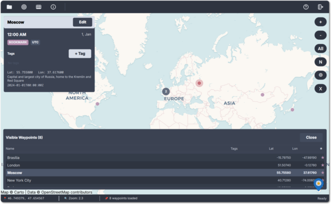

# Where Am I

A lightweight Linux desktop application for exploring waypoints, GPX archives,
bookmarks, and location history on an interactive vector map.



## Features

- **Interactive vector map**: Explore a pinned OpenFreeMap/Liberty basemap rendered directly through public Qt Quick scene-graph APIs
- **Smooth navigation**: Pan, rotate, wheel-zoom, pinch-zoom, and animate between locations while retaining map coverage during tile transitions
- **Bookmarks**: Add, rename, tag, and delete saved locations
- **GPX import**: Recursively import GPX files from a selected directory
- **Search**: Search local waypoints and remote Nominatim geocoding results
- **Filters**: Show bookmarks only, filter by tag, or select an inclusive UTC date range
- **Timeline**: Travel through significant recorded locations on an animated offline-resolved map
- **Themes**: Six runtime-selectable color themes
- **Keyboard shortcuts**: Open the in-app shortcut list with `Ctrl+?` or `Ctrl+/`

> [!WARNING]
> WhereAmI is beta-quality software. It has been tested in a Fedora Workstation environment only.

## Installation

### From a Release

Download the Flatpak bundle from the [releases page](https://github.com/rubiojr/whereami/releases) and install it:

```bash
flatpak install --user io.github.rubiojr.whereami.flatpak
```

Packaging lives in [whereami-flatpak](https://github.com/rubiojr/whereami-flatpak).

### From Source

Requirements: Go 1.25 or newer, Qt 6.5 or newer, `pkg-config`, GCC/G++, and
`miqt-rcc`.
The default OpenFreeMap renderer is included in the application and uses public
Qt Quick scene-graph APIs. MapLibre Native is optional and is used only when
`--legacy-map-renderer` is requested or the Go renderer cannot initialize.

Administrative place timelines use an optional local Xiangshan generation. See
`docs/GEODATA.md` for `make geodata-build`, `make geodata-dist`, and the
isolated `make geodata-run-local` workflow.

```bash
git clone https://github.com/rubiojr/whereami.git
cd whereami
make build
bin/whereami
```

See [BUILD.md](BUILD.md) for detailed build instructions.

## Vector Map Renderer

The default renderer is implemented in the reusable Go package
[`pkg/vecmap`](pkg/vecmap). It provides a parentless Qt Quick item, a
QML-facing camera property map, Web Mercator projection helpers, bounded tile
loading, retained scene-graph nodes, Liberty style rendering, and SDF labels.

The renderer:

- Uses a pinned OpenFreeMap tile snapshot and embedded Liberty style, sprite
  atlas, and fallback fonts
- Supports OpenGL, Vulkan, Metal, Direct3D, and OpenGL ES through Qt's Rendering
  Hardware Interface shader packs
- Keeps parent or descendant tile coverage visible while detailed tiles load
- Treats pathological per-feature geometry as a non-fatal degradation instead
  of failing the whole tile
- Bounds tile bytes, decoded geometry, triangulation work, symbols, concurrent
  requests, retries, and persistent cache size
- Uses only public Qt Quick scene-graph APIs

Applications in this module can import `github.com/rubiojr/whereami/pkg/vecmap`.
Construction and teardown must run on Qt's GUI thread after a `QGuiApplication`
exists. See [`pkg/vecmap/README.md`](pkg/vecmap/README.md) for the package API and
integration example.

A minimal runnable application is available in
[`examples/map`](examples/map):

```bash
make -C examples/map
./examples/map/map
```

## Use Case

WhereAmI can display location history exported as GPX. One example is combining it with [hass2geo](https://github.com/rubiojr/hass2geo) and the [Home Assistant companion app](https://companion.home-assistant.io/) to keep location history in a private Home Assistant instance and import the resulting GPX directory.

## Usage

- **Add a bookmark**: Right-click the map. To reuse a selected or searched location, press `Ctrl+Enter` or `Ctrl+Return`.
- **Import GPX**: Select a directory with the folder button in the toolbar. Import scans recursively, preserves relative paths, replaces changed files atomically, and reports unsupported or invalid files separately.
- **Search**: Press `Ctrl+F` and use the search box.
- **Filter by date**: Use the calendar button in the toolbar to choose a day, range, or UTC date preset. Click the highlighted button again to clear the filter.
- **Explore a year**: Use the timeline button to open the current year's timeline, then move through older or newer locations. Consecutive movement below 100 meters is grouped into one stop.
- **Navigate**: Drag to pan, use the mouse wheel to zoom, or use touch pinch gestures.
- **Themes**: Start the application with `--theme=<variant>`, where the variant is `orange`, `green`, `purple`, `adwaita-dark`, `nord-polar`, or `nord-frost`. The default is `nord-polar`.
- **All shortcuts**: Press `Ctrl+?` or `Ctrl+/`.

## Command-Line Options

```text
-cache-dir string
      custom cache directory (overrides XDG_CACHE_HOME)
-config-dir string
      custom config directory (overrides XDG_CONFIG_HOME)
-data-dir string
      custom data directory (overrides XDG_DATA_HOME)
-debug
      enable debug logging
-geodata-manifest string
      local development geodata manifest override
-legacy-map-renderer
      use the legacy QtLocation MapLibre renderer
-theme string
      theme variant (orange|green|purple|adwaita-dark|nord-polar|nord-frost)
-vector-prototype
      force the Go vector renderer and enable renderer smoke options
-vector-prototype-duration duration
      quit after this duration for renderer smoke tests
-vector-prototype-zoom float
      initial zoom for renderer smoke tests (default 9)
```

## Storage

On Linux, the defaults are:

- Data: `${XDG_DATA_HOME:-$HOME/.local/share}/whereami/`
- Cache: `${XDG_CACHE_HOME:-$HOME/.cache}/whereami/`
- Configuration: `${XDG_CONFIG_HOME:-$HOME/.config}/whereami/`

The data directory contains bookmarks, imported GPX files, tags, and search history. The cache directory contains geocoding caches, a rebuildable observation index, dataset-versioned administrative resolutions used by timelines, and map caches. The three command-line directory options override these locations.

The Go renderer stores vector tiles, Natural Earth rasters, and OpenFreeMap SDF
glyph ranges under `vector/` as atomically committed payload/checksum pairs with
a 256 MiB budget. The embedded Liberty style, sprite atlas, and cross-backend
text shaders do not require cache downloads. The optional legacy renderer keeps
its separate `maplibre/` cache.

Resource-limited individual features are skipped safely and reported as
`[WARN] vecmap ...` lines without activating the map error overlay. Actual tile,
network, style, glyph, or cover failures are reported as `[ERROR]` lines with
tile or glyph-range context.

## License

The application source is under the MIT License. See [LICENSE](LICENSE). Builds
that bundle the optional MapLibre Native Qt fallback must also include its
upstream licenses. The embedded KlokanTech Noto Sans map fonts are under the
SIL Open Font License 1.1; their provenance and license are in
[`pkg/vecmap/fonts`](pkg/vecmap/fonts).
The SDF shader includes MapLibre-derived thresholds under the BSD 3-Clause
notices in [`ui/shaders/LICENSE`](ui/shaders/LICENSE).

## Contributing

Run the primary checks before submitting changes:

```bash
go test ./...
go vet ./...
make qml-test
make build
```

Renderer lifecycle and race coverage is available with:

```bash
go test -race -tags=integration ./pkg/vecmap
```

See [BUILD.md](BUILD.md) for native dependencies and detailed build workflows,
and [.rules](.rules) for project guidance.
